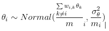

# Sprawl Score
Developed for the Canadian Urban Environmental Health Research Consortium (CANUE)
[https://canue.ca/](https://canue.ca/)

## Chapter 1: Background
Urban sprawl is of interested to multiple disciplines including, urban planning, public health, economics, and transportation engineering (Knaap, Song, Ewing, & Clifton, 2005). A consensus on the definition of urban sprawl is lacking. Urban sprawl is loosely defined as inefficient, unordered, and unorganized urban growth, which manifests in the forms of decentralization, fragmentation, and low-density of residence (Ewing, Pendall, & Chen, 2002). 

The negative impacts of urban sprawl have been widely studied. There is ample evidence that urban sprawl significantly correlates with increased energy use, pollution, traffic congestion (Ewing & Hamidi, 2015). It also contributes to a decline in community cohesiveness and the deconstruction of wildlife habitats. The impact of urban sprawl on public health has also been studied. Past research has suggested that urban sprawl is significantly associated with physical inactivity (Frumkin, 2002), higher Body Mass Index (BMI) (Ross et al., 2007) and odds of being obese (Ewing, Brownson, & Berrigan, 2006), lower traffic safety (Ewing & Dumbaugh, 2009), and higher prevalence of heart disease (Griffin et al., 2013). 

Numerous multi-dimensional approaches have been developed to construct urban sprawl indices. For example, Galster et al. (2001) conceptually defined urban sprawl with eight distinct dimensions: density, continuity, concentration, clustering, centrality, nuclearity, mixed uses, and proximity. Ewing et al. (2003) developed an urban sprawl index at the metropolitan area level with four dimensions of urban forms, namely residential density, street accessibility, land use mix, and degree of centering. This index was developed at the county level as well but with the first two dimensions only. Their research team recently updated the county-level index with all four dimensions, in parallel with the metropolitan area level index (Ewing et al., 2014). Frenkel and Ashkenazi (2008) measured urban sprawl by weighting thirteen variables from three dimensions ??? density, scatterness, and mixture of land uses; Arribas-Bel et al. (2011) proposed a conceptual framework for measuring urban sprawl which is composed of two categories: one, urban morphology with dimensions scattering, connectivity, and availability of open space; and two, internal composition with dimensions density, decentralization, and land-use mix.

Previous studies predominantly study urban sprawl at large-area levels, for example, the Census Metropolitan Area. Analyzing urban sprawl at a finer geographical scale (i.e., smaller area level such as Census Tract) however, is justifiable. Built environments in a small area are more homogeneous with central and outlying areas being more similar, thus better representing residents day-to-day activities (Ewing et al., 2014, 2003). Using a smaller area level could potentially lead to the increased explanatory and predictive power of urban sprawl on health outcomes, especially when individual-level rather than ecological analysis is conducted. Developing urban sprawl indices at small-area levels poses challenges for statistical modelling. A majority of past research applies non-spatial modelling. While this might not be an issue for analyses at large-area levels, it is potentially problematic for small-area analyses, given that small-area sprawl indicators (e.g., population density) tend to be similar in adjacent areas (a.k.a. the spatial autocorrelation issue). To address this issue, a spatial version of dimension-reduction statistical approaches such as spatial factor analysis is needed. Otherwise, biased and imprecise inferences could be obtained for urban sprawl estimations.

Although urban sprawl is a global issue, previous studies have been primarily conducted in the United States. The website of National Cancer Institute (https://gis.cancer.gov/tools/urban-sprawl/) provides nationwide urban sprawl indices at multiple geographical levels (i.e., metropolitan, county, and census tract) in the United States. In contrast, there have been fewer studies that explore urban sprawl in the Canadian context, usually at large-area levels. For example, Ross et al. (2007) created a urban sprawl index at the Canadian Metropolitan Area (CMA) level, which is an unweighted sum of three indicators, namely the proportion of single or detached dwellings in a CMA, dwelling density, and the percentage of CMA population living in an urban core. 

The objective this research is to develop a multi-dimensional, nationwide urban sprawl index for Canada at a small-area level (i.e., Census Tract, CT) using spatial statistical modelling, filling the gap that a comprehensive urban sprawl index at a fine spatial scale is missing in Canada. 

## Chapter 2: Sprawl score indicators
This study included urban sprawl indicators along four dimensions, density, mix use, street connectivity, and centering. These dimensions have been widely used in the urban sprawl/compactness studies in North America (Ewing et al., 2014, 2003). Descriptions of these indicators are provided in Table 1.

### Table 1: indicators used to develop the composite urban sprawl index 

<table class="tg">
  <tr>
    <th class="tg-fymr">Sprawl Dimension</th>
    <th class="tg-fymr">Sprawl indicator</th>
    <th class="tg-fymr">Description</th>
    <th class="tg-fymr">Data Source </th>
  </tr>
  <tr>
    <td class="tg-c3ow" rowspan="2">Density </td>
    <td class="tg-0pky">Gross population density (person/mile2</td>
    <td class="tg-0pky">Population divided by the land area of a CT1</td>
    <td class="tg-0pky" rowspan="4">Canadian Census</td>
  </tr>
  <tr>
    <td class="tg-0pky">Gross employment density (person/mile2</td>
    <td class="tg-0pky">Employed population (15+) divided by the land area of a CT</td>
  </tr>
  <tr>
    <td class="tg-c3ow" rowspan="2">Centering</td>
    <td class="tg-0pky">Coefficient of variation in DA2 population densities</td>
    <td class="tg-0pky">Standard deviation divided by the mean of DA population densities within a CT</td>
  </tr>
  <tr>
    <td class="tg-0pky">Coefficient of variation in employment densities</td>
    <td class="tg-0pky">Standard deviation divided by the mean of DA employment densities within a CT</td>
  </tr>
  <tr>
    <td class="tg-c3ow">Land Use </td>
    <td class="tg-0pky">Land-use mix</td>
    <td class="tg-0pky">Calculated based on the Entropy Index, $-[\sum_{j=1}^{k} P^j \ln(P^j)] / \ln (k)$ , where Pj is the percentage of land use type j, and k is the total number of land use types. Six different land use types included: (1) residential, (2) commercial, (3) government and institutional, (4) open area, (5) parks and recreational, and (6) resource and industrial.</td>
    <td class="tg-0pky">DMTI Spatial</td>
  </tr>
  <tr>
    <td class="tg-c3ow" rowspan="4">Street Accessibility</td>
    <td class="tg-0pky">Average DA size</td>
    <td class="tg-0pky">Mean land areas of DAs within a CT</td>
    <td class="tg-0pky" rowspan="4">Statistics Canada</td>
  </tr>
  <tr>
    <td class="tg-0pky">% of small DAs (<0.05 mile2)</td>
    <td class="tg-0pky">Percentage of <0.05 mile2 DAs within a CT</td>
  </tr>
  <tr>
    <td class="tg-0pky">Intersection density</td>
    <td class="tg-0pky">Intersection count divided by the land area of a CT</td>
  </tr>
  <tr>
    <td class="tg-0pky">% of 4-or-more way intersections</td>
    <td class="tg-0pky"># of 4-or-more way intersections divided by total # of intersections within a CT</td>
  </tr>
</table>
Notes. CT = Census Tract; DA = Dissemination Area

## Chapter 3: Statistical Method 

The calculation of sprawl indicators has been described in Table 1. This section introduces the statistical approach used to derive the composite urban sprawl index: Bayesian spatial factor analysis. 

Originating in psychometrics, factor analysis is a statistical approach to describe the variation and correlation of a set of observable and correlated indicators with a lower number of latent factors that cannot be directly observed or measured (e.g., Brown, 2015). Conceptually, urban sprawl is abstract and unobservable, but manifests in the form of a variety of observable and correlated indicators, for example, those listed in Table 1. In this sense, factor analysis is well-suited for developing an urban sprawl index. Sprawl indicators at a small-area level however, are usually spatially auto-correlated. That is, values of sprawl indicators in adjacent areas are similar. To account for the spatial autocorrelation in statistical inferences of factor analysis, a Bayesian approach is more feasible than a Frequentist approach. 

In particular, each standardized sprawl indicator was assumed to follow a Normal distribution with mean
 and variance .  was further decomposed with an intercept  and a product  representing the average of sprawl indicator j over Canada and  being the factor loading that indicates the correlation between indicator j and the derived composite sprawl index . Regarding priors of the unknown parameters, we specified a non-informative flat prior to $\alpha _{j}$. A log-normal distribution with mean zero and variance 100 was assigned to $\delta _{1}$, constraining $\delta _{1}$ to be positive. This approach is adopted to avoid the ???flip-flop??? problem in that $\delta _{j} * \vartheta_{j}=\left ( - \delta _{j}\right )*\left ( \vartheta_{j} \right )$. ). The remaining $\delta _{j}$'s were specified a prior of a normal distribution with mean 0 and variance 1,000. The spatial prior, intrinsic Conditional Autoregressive (iCAR), was specified to the composite sprawl index $\vartheta_{j}$ attempting to capture the spatial structure within sprawl indicators. Specifically, the expected mean of $\vartheta_{j}$ equals the average values of its neighbours, and the variance of $\vartheta_{j}$ is inversely proportional to the number of its neighbours, mi. . We applied the most common approach to define neighbours in small-area analyses: areas sharing at least one vertex. . For identifiability reasons, we set the variance of $\theta$ as 1, equivalent to standardizing $\vartheta_{j}$'s. A vague prior Gamma(0.5, 0.0005) was specified to the precision of Yij (the inverse of variance $\sigma _{j}^{2}$ ).

## Chapter 4: Limitations 

Several limitations of the sprawl index should be acknowledged. First, due to data availability issue at the national scale, we included 9 sprawl indicators only. Some indicators used in other studies, especially in North American studies, such as job-population mixing and degree of job mixing (Ewing et al., 2014, 2003) are not included in developing the composite sprawl index. Second, we used six land use types, namely, residential, commercial, government and institutional, open area, parks and recreational, and resource and industrial to calculate land use mix. While there is no consistency in terms of the inclusion of land types to calculate land use mix, we selected these types based on data availability and past literature that explored the association between health and land use mix. Future research exploring how different land type inclusions impact the results is warranted.

## Chapter 5: Metadata

The CANUE website provides the final composite sprawl index for each Census Tract as well as additional information from the posterior distribution. In total, 5 variables are provided. Table 2 shows the name and a short description of each variable.

<table class="tg">
  <tr>
    <th class="tg-fymr">Variable Name </th>
    <th class="tg-fymr">Description </th>
  </tr>
  <tr>
    <td class="tg-c3ow">sprawl</td>
    <td class="tg-0pky">Composite sprawl score of a census tract, with mean 0 and standard deviation 1. The posterior mean from the Bayesian model.</td>
  </tr>
  <tr>
    <td class="tg-c3ow">lower</td>
    <td class="tg-0pky">The 2.5% percentile of the posterior distribution of the composite score</td>
  </tr>
  <tr>
    <td class="tg-c3ow">median</td>
    <td class="tg-0pky">The median of the posterior distribution of the composite score</td>
  </tr>
  <tr>
    <td class="tg-c3ow">upper</td>
    <td class="tg-0pky">The 97.5% percentile of the posterior distribution of the composite score</td>
  </tr>
  <tr>
    <td class="tg-c3ow">CTUID</td>
    <td class="tg-0pky">Unique identifier for each census tract</td>
  </tr>
  <tr>
    <td class="tg-c3ow">POLYID</td>
    <td class="tg-0pky">Polygon identifer. A list from 1 to n.</td>
  </tr>
</table>

### References 

Arribas-Bel, D., Nijkamp, P., & Scholten, H. (2011). Multidimensional urban sprawl in Europe: A self-organizing map approach. Computers, Environment and Urban Systems, 35(4), 266-275. [http://doi.org/10.1016/j.compenvurbsys.2010.10.002](http://doi.org/10.1016/j.compenvurbsys.2010.10.002)

Brown, T. A. (2015). Confirmatory Factor Analysis for Applied Research (Second Edi). New York: The Guilford Press. [https://www.guilford.com/books/Confirmatory-Factor-Analysis-for-Applied-Research/Timothy-Brown/9781462515363](https://www.guilford.com/books/Confirmatory-Factor-Analysis-for-Applied-Research/Timothy-Brown/9781462515363)

Ewing, R., Brownson, R. C., & Berrigan, D. (2006). Relationship Between Urban Sprawl and Weight of United States Youth. American Journal of Preventive Medicine, 31(6), 464-474. [http://doi.org/10.1016/j.amepre.2006.08.020](http://doi.org/10.1016/j.amepre.2006.08.020)

Ewing, R., & Dumbaugh, E. (2009). The Built Environment and Traffic Safety A Review of Empirical Evidence. Journal of Planning Literature, 23(4), 347-367. [http://doi.org/10.1177/0885412209335553](http://doi.org/10.1177/0885412209335553)

Ewing, R., & Hamidi, S. (2015). Compactness versus Sprawl: A Review of Recent Evidence from the United States. Journal of Planning Literature, 30(4), 413-432. [http://doi.org/10.1177/0885412215595439](http://doi.org/10.1177/0885412215595439)

Ewing, R., Meakins, G., Hamidi, S., & Nelson, A. C. (2014). Relationship between urban sprawl and physical activity, obesity, and morbidity - Update and refinement. Health and Place, 26, 118-126. [http://doi.org/10.1016/j.healthplace.2013.12.008](http://doi.org/10.1016/j.healthplace.2013.12.008)

Ewing, R., Pendall, R., & Chen, D. (2002). Measuring Sprawl and Its Impact. Smart Growth America. [https://www.smartgrowthamerica.org/app/legacy/documents/MeasuringSprawl.PDF](https://www.smartgrowthamerica.org/app/legacy/documents/MeasuringSprawl.PDF). Retreived, 14 August 2012.

Ewing, R., Schmid, T., Killingsworth, R., Zlot, A., & Raudenbush, S. (2003). Relationship between urban sprawl and physical activity, obesity, and morbidity. American Journal of Health Promotion, 18(1), 47-57. [https://doi.org/10.4278%2F0890-1171-18.1.47](https://doi.org/10.4278%2F0890-1171-18.1.47)

Frenkel, A., & Ashkenazi, M. (2008). Measuring urban sprawl: How can we deal with it? Environment and Planning B: Urban Analytics and City Science, 35(1), 56-79. [http://doi.org/10.1068/b32155](http://doi.org/10.1068/b32155)

Frumkin, H. (2002). Urban Sprawl and Public Health. Public Health Reports, 117(3), 201-217. [http://doi.org/10.1177/1476127005050030](http://doi.org/10.1177/1476127005050030)

Galster, G., Hanson, R., Ratcliffe, M. R., Wolman, H., Coleman, S., & Freihage, J. (2001). Wrestling Sprawl to the Ground: Defining and measuring an elusive concept. Housing Policy Debate, 12(4), 681-717. [http://doi.org/10.1080/10511482.2001.9521426](http://doi.org/10.1080/10511482.2001.9521426)

Griffin, B. A., Eibner, C., Bird, C. E., Jewell, A., Margolis, K., Shih, R., ??? Escarce, J. J. (2013). The relationship between urban sprawl and coronary heart disease in women. Health & Place, 20, 51???61. [http://doi.org/10.1016/j.healthplace.2012.11.003](http://doi.org/10.1016/j.healthplace.2012.11.003)

Knaap, G.-J., Song, Y., Ewing, R., & Clifton, K. (2005). Seeing the Elephant: Multi-disciplinary Measures of Urban Sprawl. Landscape Ecology, 1-46. [https://doi.org/10.13016/M20G3H292](https://doi.org/10.13016/M20G3H292)

Ross, N. a, Tremblay, S., Khan, S., Crouse, D., Tremblay, M., & Berthelot, J.-M. (2007). Body mass index in urban Canada: neighborhood and metropolitan area effects. American Journal of Public Health, 97(3), 500-508. [http://doi.org/10.2105/AJPH.2004.060954](http://doi.org/10.2105/AJPH.2004.060954)

